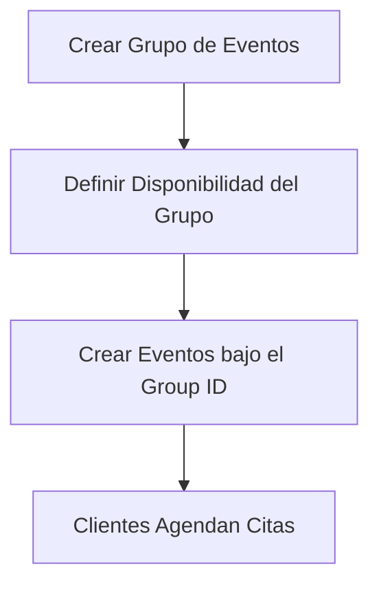

# Guía de Base de Datos para el Desarrollador de Frontend

Esta guía detalla la estructura actualizada de la base de datos con soporte para **Grupos de Eventos** (`event_groups`), la cual evita el solapamiento no deseado de citas entre distintos servicios y permite gestionar múltiples calendarios de disponibilidad de forma independiente (ej. consultorios o doctores distintos).

---

## 1. Estructura de Tablas y Atributos

### Tabla: `users` (Administradores/Dueños de Comercio)
Guarda los datos de acceso del administrador del comercio.
*   **`id`** (`Integer`): ID autoincrementable (PK).
*   **`email`** (`String`): Correo único del administrador.
*   **`name`** (`String`): Nombre del comercio o administrador.
*   **`role`** (`String`): Rol del usuario (por defecto `"admin"`).

### Tabla: `event_groups` (NUEVA: Grupos de Citas / Recursos)
Representa un calendario unificado de disponibilidad. Múltiples servicios pueden pertenecer al mismo grupo para compartir agenda y evitar sobre-reservas.
*   **`id`** (`Integer`): ID autoincrementable (PK).
*   **`user_id`** (`Integer`): ID del administrador dueño del grupo.
*   **`name`** (`String`): Nombre descriptivo (ej. *"Consultorio Dental A"*, *"Estilista María"*).
*   **`is_active`** (`Boolean`): Indica si el grupo y sus eventos están disponibles.

### Tabla: `events` (Servicios / Tipos de Cita)
Guarda los diferentes servicios o tipos de citas configurables creados por el admin. **Ahora está asociado a un grupo.**
*   **`id`** (`Integer`): ID autoincrementable (PK).
*   **`group_id`** (`Integer`): ID del grupo al que pertenece el evento. **Indispensable.**
*   **`title`** (`String`): Nombre del servicio (ej. *"Corte de Cabello"*, *"Limpieza Dental"*).
*   **`description`** (`Text`): Descripción detallada para el cliente (opcional).
*   **`duration`** (`Integer`): Duración de la cita en **minutos**.
*   **`buffer_time`** (`Integer`): Tiempo de espera o descanso requerido después de la cita en **minutos**.
*   **`is_active`** (`Boolean`): Indica si el servicio está activo para reservas.

### Tabla: `group_availabilities` (Disponibilidad Horaria del Grupo)
Define los rangos horarios semanales recurrentes en los que está activo el grupo de eventos.
*   **`id`** (`Integer`): ID autoincrementable (PK).
*   **`group_id`** (`Integer`): ID del grupo asociado.
*   **`day_of_week`** (`Integer`): Día de la semana (**1 = Lunes**, **7 = Domingo**).
*   **`start_time`** (`Time`): Hora de inicio (formato `"HH:MM:SS"`, ej. `"09:00:00"`).
*   **`end_time`** (`Time`): Hora de fin (formato `"HH:MM:SS"`, ej. `"18:00:00"`).

### Tabla: `appointments` (Citas Reservadas)
Guarda las citas agendadas por los clientes.
*   **`id`** (`Integer`): ID autoincrementable (PK).
*   **`event_id`** (`Integer`): ID del evento específico reservado.
*   **`client_name`** (`String`): Nombre del cliente.
*   **`client_email`** (`String`): Correo del cliente.
*   **`client_phone`** (`String`): **Teléfono del cliente** (dato crítico para que el admin lo contacte).
*   **`start_time`** (`DateTime`): Fecha y hora de inicio (ISO-8601 UTC: `"YYYY-MM-DDTHH:MM:SSZ"`).
*   **`end_time`** (`DateTime`): Fecha y hora de fin (calculada sumando la duración al inicio).
*   **`status`** (`String`): Estado de la cita (`"pending"`, `"confirmed"`, `"cancelled"`).
*   **`notes`** (`Text`): Comentarios o peticiones del cliente (opcional).

---

## 2. Formato de Datos Requeridos

1.  **Fechas y Horas Completas (Citas):**
    *   Utilizar formato **ISO-8601 UTC**. Ej: `2026-05-24T14:30:00Z`.
2.  **Horas de Disponibilidad Semanal:**
    *   Utilizar formato de 24 horas `"HH:MM:SS"` o `"HH:MM"`. Ej: `09:00:00`.
3.  **Días de la semana:**
    *   Números enteros del **1 (Lunes)** al **7 (Domingo)**.

---

## 3. Flujos de Trabajo Actualizados para el Frontend



### Flujo A: Configuración de la Agenda (Admin)
1.  **Crear el Grupo:** El administrador crea una agenda unificada (ej. *"Dr. Alejandro - Consultorio A"*).
2.  **Configurar Horarios del Grupo:** El administrador define cuándo atiende este grupo.
    *   *Payload a enviar a `group_availabilities`:*
        ```json
        {
          "group_id": 1,
          "availabilities": [
            { "day_of_week": 1, "start_time": "09:00", "end_time": "17:00" },
            { "day_of_week": 2, "start_time": "09:00", "end_time": "17:00" }
          ]
        }
        ```
3.  **Crear Servicios:** El administrador da de alta los servicios asignándolos a ese grupo.
    *   *Ejemplo:* *"Limpieza Dental"* (duración 30 min) y *"Ortodoncia"* (duración 60 min) creados con `group_id: 1`.

### Flujo B: Búsqueda de Slots Libres y Evitación de Solapamientos (Cliente)
Para renderizar las horas disponibles de un evento:
1.  El cliente selecciona un evento (ej. *"Limpieza Dental"*).
2.  El frontend consulta disponibilidad al backend para una fecha.
3.  **Lógica del Backend (Crucial):**
    *   Obtiene la disponibilidad de la tabla `group_availabilities` del grupo correspondiente.
    *   Busca **todas las citas confirmadas de cualquier evento que pertenezca al mismo `group_id`** en esa fecha.
    *   **Resultado:** Si ya hay una cita de *"Ortodoncia"* reservada de `10:00` a `11:00`, ese horario se bloqueará automáticamente para la *"Limpieza Dental"*, evitando solapamientos involuntarios del mismo profesional.

### Flujo C: Confirmación de Cita (Cliente)
El cliente reserva una hora proporcionando sus datos de contacto. POST a la API:
```json
{
  "event_id": 2,
  "client_name": "Sofía Martínez",
  "client_email": "sofia@example.com",
  "client_phone": "+56998765432",
  "start_time": "2026-05-26T15:30:00Z",
  "notes": "Primera visita al consultorio."
}
```

### Flujo D: Agenda y Contacto Directo (Admin)
El administrador visualiza todas sus citas de forma unificada agrupando por el recurso o profesional. El backend resolverá los datos cruzando las relaciones (`appointment.event.group`).
*   La interfaz del frontend debe mostrar claramente el **nombre y teléfono del cliente** con accesos directos de comunicación (como botones de WhatsApp o llamadas directas: `tel:+56998765432`).
